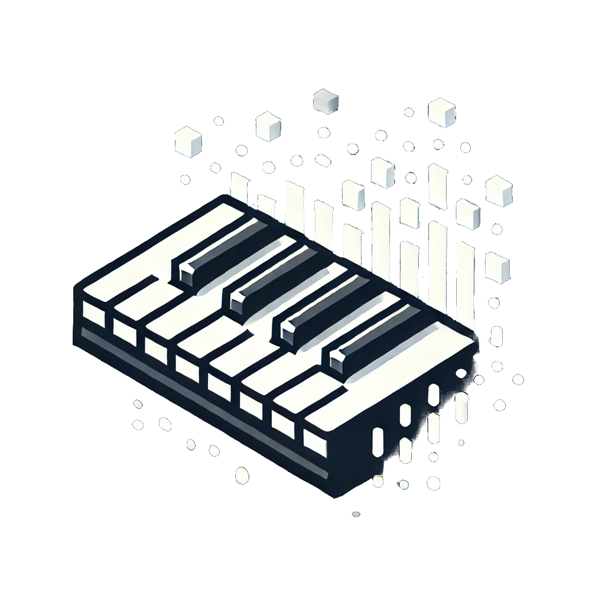

<br />
<div align="center">
  <a href="https://github.com/tzmcion">
    
    <h3>PIANO-BLOCKS-APP</h3>
  </a>

  <h3 align="center">Piano MIDI player/visualizer designed for MIDI playback with various visual configurations and effects </h3>

  <p align="center">
<!--     <a href="https://github.com/tzmcion/bio-meeting/wiki"><strong>Explore the docs</strong></a> -->
    <a href="https://react-piano-player-tymota-aprions-projects.vercel.app/">Visit Latest Version of the app</a>
  </p>
  <p align="center">
  
  
  
  
  
  
  </p>
</div>


# Webb App for MIDI playback with visualization

PianoBlocksApp is a web application made for hobbists/enthusiasts of playing piano. This app provides a very simple way to visualize a persons piano playing, by reading the MIDI recording. It's main focus is to implement - alongside MIDI player - pallet of effects and configuration of the visuals. Essentially, this app is designed to be recorded and used for a video creation for YouTube, or other websites/purposes. If you are looking for a MIDI player app for music learning, please fell free to use this app, but I recomend a better application: <a href="https://github.com/Bewelge/MIDIano">MIDIano</a>
> [!IMPORTANT]
 Version of the app on "main" branch is not always up-to-date and does not alwasy contain all the bugs fixed


## Description

App is a MIDI-player. What it does it converts the inserted midi file, verifies it's compatibility, compresess all the tracks to single track, and plays the file. The main goal of the app is not to facilitate learning process for musicians, rather to find a simple way of recreating fancy videos found in online-creators channels on YouTube, or other streaming platforms. The app provides a pallete of options and effects to implement during playback.

>[!TIP]
> <b>Main Advantages of Piano-Blocks-App:</b>
> <ul>
>  <li>Playback Stop/Pause/Reset/Jump Forward-Backwards</li>
>   <li>Independent sound from piano - sound will realistically still be played if a key is pressed</li>
>   <li>Independent effects canvas - Effects will still render even if the playback is paused</li>
>   <li>Visual configuration - Visualization can be easily configured</li>
>   <li>Mobile devices compatibility - altough performance can be poor, app is compatibile with mobile devices</li>
>   <li>Presets - App comes with ready presets to choose from - either better for performance or visuals</li>
> </ul>


### How does the app work ? 


<ol>
 <li>
  <b>User input</b></br>
  User Drags/chooses Midi file. He can configure options before that, using the preview view to see the results
 </li>
 <li>
  <b>Website proceses the inserted MIDI</b></br>
  Website saves the file to localstorage, checks it's extensions, converts the MIDI format to compatibile with the app - Midi has 3 different formats used. It also combines multiple tracks into one single track.
 </li>
 <li>
 <b>Website creates canvas animation</b></br>
  Canvas animation is created, the app uses 5 separate canvas elements to render everything properlly.
 </li>
</ol>

## Installation

Just like every other github repo

```
git init
git pull https://github.com/tzmcion/ReactPianoPlayer
npm i 
```

Or git clone

```
git clone https://github.com/tzmcion/ReactPianoPlayer
```

> [!CAUTION]
> * Sometimes multiple resizing can cause BUGs to appear - please refresh the page if that happens
> * Currently the record page is being reworked on - sorry for the inconvinience
> * Many more effects and configuration options will appear in the future
> * Some dependencies in `package.lock` are not used
> * Many files and classes are currently set as @deprecated, be aware if you clone this repository
> * If you'd like to work on this app, I will explain how every file works to you with pleasure, just write :)


## License

__MIT__ license


